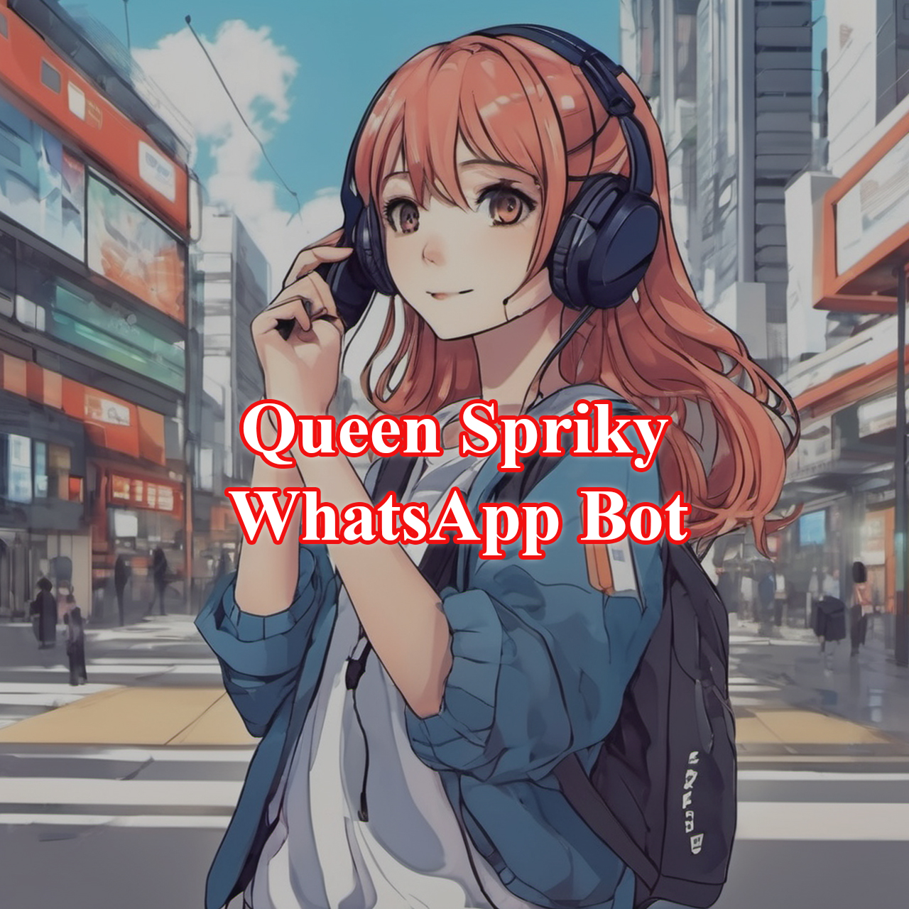

<div class = "repo" align = "center">
<a href = "#">

</img>

 <p align="center">
  <a href="#">
</p>


[]()
[]()
[]()

---
</div>
## Overview

Welcome to the GitHub repository for **Queen Spriky WhatsApp Bot**! This bot is designed to enhance your WhatsApp experience with various commands and features. Please note that We are not responsible for account bans<br>(Use At Your Own Risk)

---

## Important Links

- [YouTube Tutorial](https://www.youtube.com/watch?v=P4hexyhRfuo&t=24s)
- [Support WhatsApp Group](https://chat.whatsapp.com/EieFsPEnrPnERM6GXPF162)
- [WhatsApp Bot Group](https://chat.whatsapp.com/Jx2dvOAzNaO3vm5bwVglyC)

---

## How To Deploy
 - _Fork the repository._
 - _Link with whatsapp using pair code._
 - _Open Config.js and put `botNumber` and `ownerNumber` and change other settings._
 - _Deploy using your platform._
   </br>

## Fork Repository

<a href="https://github.com/uwtechshow-official/Queen-Spriky-WhatsApp-Bot/fork"></a>

## Generate Session

<a href="https://replit.com/@sweetheartsorry/Queen-Spriky-WhatsApp-Bot-Pair"></a>

## Deploy Using Your Platform

<a href="https://replit.com/@sweetheartsorry/Queen-Spriky-WhatsApp-Bot-Pair"></a><br>
<a href="https://replit.com/@sweetheartsorry/Queen-Spriky-WhatsApp-Bot-Pair"></a><br>
<a href="https://replit.com/@sweetheartsorry/Queen-Spriky-WhatsApp-Bot-Pair"></a>

## Run Terminal(Ubuntu)

Update dependencies

```bash
  apt update
```

Clone the project

```bash
  git clone https://github.com/uwtechshow-official/Queen-Spriky-WhatsApp-Bot
```

Go to the project directory

```bash
  cd Queen-Spriky-WhatsApp-Bot
```

Install dependencies

```bash
  npm install
```

Start the server

```bash
  npm start
```

## Main Command Categories

- **Owner Commands:** This Contains Some Owner Commands.
- **General Commands:** This Contains Some Genaral Commands.
- **Search Commands:** This Contains Some Search Commands.
- **Random Commands:** This Contains Some Random Commands.
- **Game Commands:** This Contains Some Game Commands.

---

## Developer Contacts

- **WhatsApp:** [+94758900210](https://wa.me/94758900210)
- **Instagram:** [Your Instagram](https://instagram.com/udavin_wijesundara?igshid=OGQ5ZDc2ODk2ZA==)
- **YouTube:** [UW TECH SHOW](https://www.youtube.com/@uwtechshow)

---
## Authors

- [@Udavin Wijesundara](https://github.com/uwtechshow-official)
- [@Vima Mods](https://github.com/vimamodz)
